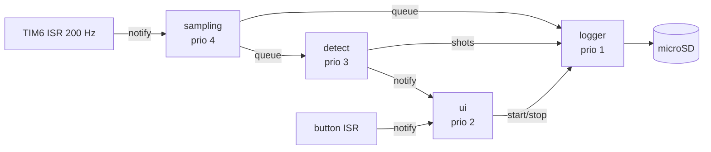
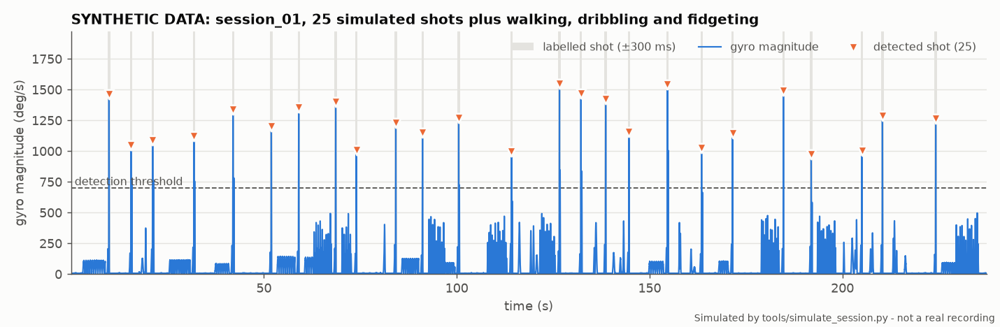
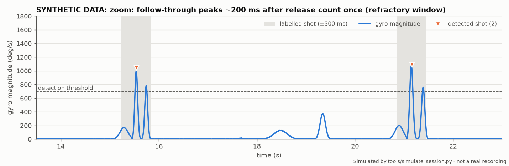

# ShotTrack

[](https://github.com/hashimbabar/shot-track/actions/workflows/ci.yml)

A wrist-worn sensor that counts my basketball shots during practice, like a
step counter for shots. I play basketball often and wanted real numbers
on how many shots I actually put up, instead of guessing.

**Status:** v1 firmware, driver and detector complete, with 25 host tests and
replay checks passing in CI. Hardware bring-up in progress.

## What it does (v1)

- **Samples an MPU-6050 IMU at 200 Hz** from a hardware timer interrupt on an
  STM32L432 (NUCLEO-L432KC), using FreeRTOS.
- **Detects each shot** from the wrist-flick peak: filtered gyro magnitude,
  threshold with hysteresis, an accel check, and a refractory window so one
  shot isn't counted twice.
- **Logs sessions to a microSD card** as CSV from a low-priority task fed by
  a queue, so slow SD writes can't hold up sampling.
- **Counts dropped samples** instead of hiding them (sequence numbers, queue
  overflow counters, debug pins for a logic analyzer).
- **Button** to start/stop a session, **LED** flash per detected shot, stats
  on the serial port once a second.

Built from scratch where it matters for learning: the MPU-6050 driver is
written from the register map, and the SD card SPI driver from the SD spec.
FreeRTOS, FatFs and ST's HAL are used as-is. The MPU-6050 driver is also
published on its own as
[hashimbabar/mpu6050-driver](https://github.com/hashimbabar/mpu6050-driver).

## Architecture



Sampling has the only hard deadline (every 5 ms), so it gets the highest
priority. The SD card can stall for hundreds of milliseconds, so the logger
gets the lowest priority and a 640 ms queue in front of it. Details, interrupt
priorities and the detection pipeline are in
[docs/architecture.md](docs/architecture.md).

The detection code in `lib/detect` is plain C with no hardware calls, so the
same file runs on the STM32, in the unit tests, and in the replay tool on a
laptop.

## Repo layout

```
firmware/        STM32 application: board setup, FreeRTOS tasks, SD driver
lib/mpu6050/     MPU-6050 driver (register map, I2C via function pointers)
lib/detect/      shot detection, pure C; thresholds in detect_config.h
lib/FreeRTOS/    FreeRTOS kernel V11.1.0 (vendored, unmodified)
lib/FatFs/       FatFs R0.16 (vendored, unmodified)
test/            Unity tests run on the PC (mocked I2C bus, test signals)
tools/           session simulator, replay and plotting scripts (Python)
docs/            wiring, BOM, architecture, debugging, bring-up, roadmap
```

## Build and test

Needs [PlatformIO](https://platformio.org/) (`pip install platformio`, or the
VS Code extension) and Python 3.

```
pio run -e nucleo_l432kc              # build the firmware
pio run -e nucleo_l432kc -t upload    # flash the Nucleo over its ST-LINK
pio device monitor                    # serial console, 115200 baud
pio test -e native                    # unit tests on the PC (25 tests)
```

The unit tests cover the MPU-6050 driver against a mocked I2C bus (init
sequence, burst-read parsing, NACK and wrong-WHO_AM_I errors) and the detector
against edge cases (single shot, double peak inside the refractory window,
dribbling, flat signal, timer wraparound).

## Session simulator and replay

`tools/simulate_session.py` generates labelled practice sessions (shots,
dribbling, walking, random hand movement and sensor noise) so the detector can
be tested end to end on a laptop, and `tools/replay.py` runs the same
`detect.c` that runs on the board against them and compares to the labels.
Recorded sessions from the device go through the same replay tool.

```
pip install -r tools/requirements.txt
python tools/simulate_session.py --seed 1 --shots 25 --out data/sim/session_01.csv
python tools/replay.py data/sim/*.csv
python tools/plot_session.py data/sim/session_01.csv --out plot.png
```





CI regenerates three sessions on every push and fails if the replay doesn't
match the labels exactly. The refractory window earns its place here: with it
turned off, the detector counts 29, 25 and 29 shots instead of 25 each,
because a follow-through motion produces a second peak.

## Roadmap

1. **v1, breadboard logger** (this repo): STM32 + FreeRTOS + SD card, then
   on-court sessions checked against a hand count.
2. **v2, Bluetooth**: nRF52840 Feather on Zephyr, live shot count on my phone over BLE.
3. **v3, custom hardware**: my own KiCad PCB (nRF52840 module, IMU, LiPo
   charger, USB-C) in a 3D-printed watch case.

Full plan with the v1 step checklist: [docs/roadmap.md](docs/roadmap.md).
Wiring: [docs/wiring.md](docs/wiring.md). Parts: [docs/bom.md](docs/bom.md).

## License

MIT for my code ([LICENSE](LICENSE)). FreeRTOS (MIT) and FatFs (BSD-style)
keep their own licenses in `lib/`.
