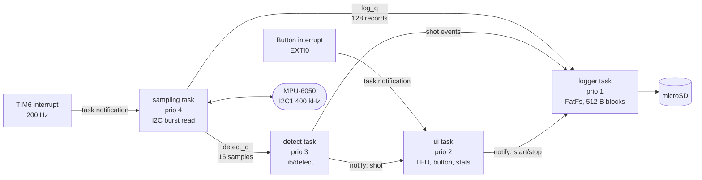
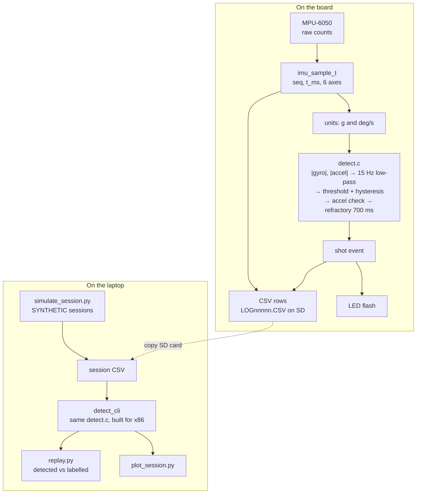

# Architecture

## Task layout

Four FreeRTOS tasks, plus two tiny interrupt handlers that only wake tasks.
A higher number means a more urgent task.

| Task | Priority | Woken by | Does | Must not |
|---|---|---|---|---|
| sampling | 4 (highest) | TIM6 notification, every 5 ms | 14-byte I2C read, stamp `seq`/`t_ms`, push to the queues | block on a queue (uses timeout 0 and counts drops) |
| detect | 3 | `detect_q` | units conversion, `detect_update()`, report shots | do I/O |
| ui | 2 | button/shot notifications, 20 ms timeout | LED pattern, debounce, stats line once a second | sit in the sampling path |
| logger | 1 (lowest) | `log_q`, start/stop notification | CSV text, 512-byte block writes, `f_sync` every 5 s | matter for timing: it can stall for an SD write and nothing else suffers |

### Why these priorities

The sampling task has the only hard deadline: one read every 5 ms. Giving
it the top priority means that whenever the timer fires, it runs next,
preempting anything else. The SD card is the opposite: a write can take
from under a millisecond to hundreds of milliseconds, unpredictably. So the
logger gets the lowest priority and a large queue in front of it. While it
is stuck in a write, sampling and detection keep running, and the queue
absorbs the backlog.

The queue size is the safety margin: `log_q` holds 128 samples = 640 ms at
200 Hz. That size is a guess from typical SD write stalls. TODO: measure
the real worst-case write time with the PA11 debug pin and resize if needed.

### Interrupts

| Interrupt | NVIC priority | Why |
|---|---|---|
| TIM6 (200 Hz) | 6 | Calls `vTaskNotifyGiveFromISR`, so it must be numerically ≥ 5 (`configMAX_SYSCALL_INTERRUPT_PRIORITY`) |
| EXTI0 (button) | 7 | Same rule; less urgent than the sample tick |
| SysTick, PendSV | 15 | FreeRTOS kernel, least urgent |

Both handlers clear their flag and send one notification. No I2C, no
printf, nothing that can block.

### Detecting missed samples

`ulTaskNotifyTake(pdTRUE, ...)` returns how many timer ticks piled up
since the task last ran. Normally that's 1. If it's 3, two samples were
missed: `missed_ticks` goes up by 2 and `seq` jumps by 3, so the gap is
also visible in the logged CSV. Drops are counted, not hidden.

## Data flow

The detection code (`lib/detect`) has no hardware calls, so the exact same
source file runs in three places: the detect task on the STM32, the Unity
tests on the PC (`pio test -e native`), and `detect_cli` for replaying
whole sessions.

## Detection in more detail

1. **Magnitudes.** `|gyro| = sqrt(gx² + gy² + gz²)`, and the same for
   accel. Using magnitudes means the result doesn't depend on exactly how
   the sensor is strapped on.
2. **Low-pass filter.** One-pole IIR, `y += α(x − y)`, with
   `α = 1 − e^(−2π·15/200) ≈ 0.376`. The 15 Hz cutoff keeps the shape of
   a wrist flick and smooths sensor noise. It delays the signal by roughly
   `1/(2π·15) ≈ 11 ms`, which doesn't matter for counting shots.
3. **Threshold with hysteresis.** A candidate starts above 700 deg/s and
   ends below 350 deg/s. Having different start and end levels stops noise
   near the threshold from splitting one peak into two.
4. **Accel check.** The filtered accel must reach 1.8 g during the
   candidate. This rejects a fast wrist turn with no arm movement.
5. **Refractory window.** A peak within 700 ms of the last counted shot is
   dropped. A follow-through can make a second gyro peak about 200 ms after
   release. On the three synthetic CI sessions, turning the window off
   gives 29, 25 and 29 shots instead of 25 each (synthetic data, see
   [README](../README.md#results)).

All five numbers are in `lib/detect/detect_config.h`. They are starting
guesses until there is real data to tune them on.

## Timing budget (estimated, not measured)

| Item | Estimate | How |
|---|---|---|
| 14-byte I2C burst read at 400 kHz | ~0.45 ms | ~18 bytes on the wire × 9 bits ÷ 400 kHz, plus start/stop |
| Sample period | 5 ms | 200 Hz |
| Sampling task CPU per sample | < 10% of the period | from the line above |
| SD block write | 1 ms to a few hundred ms | typical SD behaviour; this is why the logger is lowest priority |

TODO: measure with the logic analyzer on PA8 (sample read) and PA11 (SD
write) once the hardware is wired, and replace this table with captures.
